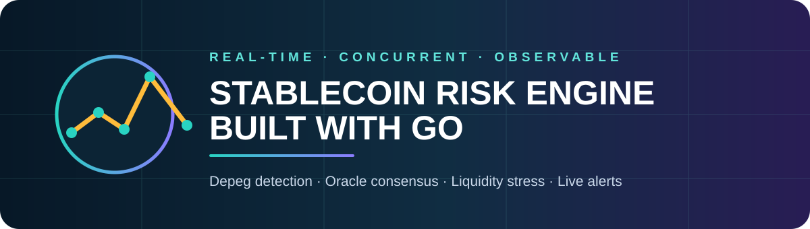
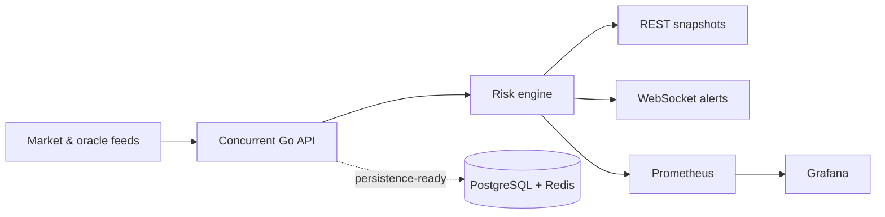

<p align="center"></p>

<p align="center">
  <a href="../../actions"></a>
  
  
  
</p>

An event-driven backend for assessing stablecoin health in real time. It converts market, collateral, redemption and oracle signals into an explainable **0–100 risk score**, publishes assessments over WebSocket, and exports operational metrics to Prometheus and Grafana.

> Research and engineering software—not financial advice or a production oracle.

## Why this project

Stablecoin failures are rarely explained by price alone. Liquidity depth, redemption pressure, collateralisation and stale or divergent oracle feeds interact. This engine combines those signals while exposing every score component, making alerts inspectable instead of opaque.

## Architecture



## Risk model

| Component | Weight | Captures |
|---|---:|---|
| Price deviation | 30% | Distance from the 1.00 peg |
| Liquidity depth | 20% | Exit capacity during stress |
| Collateral ratio | 15% | Solvency buffer deterioration |
| Oracle quality | 15% | Staleness and feed disagreement |
| Market turnover | 10% | Volume relative to liquidity |
| Redemption pressure | 10% | Emerging bank-run dynamics |

Scores map to `LOW`, `MEDIUM`, `HIGH`, or `CRITICAL`. The model is deterministic, bounded, explainable and independently unit-tested.

## Quick start

### Native Go

```bash
go mod download
go run ./cmd/server
```

### Complete observable stack

```bash
docker compose up --build
```

| Service | URL |
|---|---|
| Risk API | `http://localhost:8080` |
| Metrics | `http://localhost:8080/metrics` |
| Prometheus | `http://localhost:9090` |
| Grafana | `http://localhost:3000` (`admin` / `admin`) |

## API

Submit a market snapshot:

```bash
curl -X POST http://localhost:8080/v1/assess \
  -H 'Content-Type: application/json' \
  --data @examples/depeg.json
```

Example response:

```json
{
  "symbol": "USDX",
  "score": 92.18,
  "level": "CRITICAL",
  "depeg_bps": 370,
  "components": {
    "price": 74,
    "liquidity": 91.6,
    "oracle": 100
  },
  "alerts": [
    "price deviation exceeds 1%",
    "oracle data is stale or divergent",
    "abnormal redemption pressure"
  ]
}
```

Additional endpoints:

| Method | Endpoint | Purpose |
|---|---|---|
| `GET` | `/healthz` | Liveness probe |
| `POST` | `/v1/assess` | Score one snapshot |
| `GET` | `/v1/risks` | Latest assessment per asset |
| `GET` | `/v1/stream` | WebSocket assessment stream |
| `GET` | `/metrics` | Prometheus metrics |

## Engineering qualities

- Thread-safe in-memory state and non-blocking fan-out
- Bounded request bodies and strict input validation
- Read/write/idle HTTP timeouts
- Race-detector CI, unit tests, vet, formatting and build checks
- Multi-stage non-root distroless container
- Docker Compose stack with PostgreSQL, Redis, Prometheus and Grafana
- Small, testable domain package independent from transport code

## Development

```bash
make test
make lint
make demo
```

## Roadmap

- PostgreSQL assessment history and TimescaleDB-compatible schema
- Redis Streams ingestion and distributed workers
- Multi-oracle median and Byzantine feed rejection
- Liquidation-cascade graph simulation
- Calibrated thresholds from historical depeg episodes
- Authentication, rate limiting and signed alert webhooks

## Author

Built by **Niko Rokni** as a backend and DeFi risk-engineering research project.

## License

Released under the [MIT License](LICENSE).
